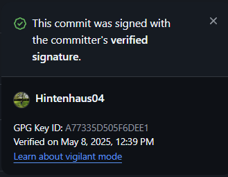

# PS-Tovenaars

Lekker toveren met PowerShell.

---

## Inhoud

* [Voorwaarden](#voorwaarden)
* [GPG Commit Signing Setup](#gpg-commit-signing-setup)
* [Branching Regels](#branching-regels)

---
## Configure VMs
Run the configure-vm.ps1 to turn off and disable unnecessary services and features for Windows VMs


## Voorwaarden

Voordat je kunt committen, heb je nodig:

1. Windows 11 Pro
2. [Gpg4win (met Kleopatra)](https://www.gpg4win.org/)
3. Git (via GitHub Desktop of VS Code)

Zorg dat je GitHub-account klaarstaat.

---

## GPG Commit Signing Setup

Volg deze stappen éénmalig om je commits te signen:

1. **Installeer Gpg4win**

   * Download en installeer van [https://www.gpg4win.org/](https://www.gpg4win.org/).
   * Selecteer tijdens installatie **Kleopatra**.

2. **Maak een sleutel aan**

   * Open **Kleopatra**.
   * Kies **Certificate → New Certificate** → **Create a personal OpenPGP key pair**.
   * Vul je naam en exact je GitHub-e‑mail in.
   * Selecteer curve25519, voltooi de wizard.
   * **Optioneel**: Vink aan dat je de key met een wachtwoord wilt beschermen.
   * Kies een einddatum zodat de key niet onbeperkt geldig is.
   * Noteer je **Key ID** (bijv. `0xABCD1234EF56`).

3. **Exporteer en registreer je publieke sleutel**

   * In Kleopatra: rechtsklik op je sleutel → **Export Certificates…** → sla op als `.asc`.
   * Open het `.asc` bestand, kopieer alles.
   * Ga naar GitHub → **Settings → SSH and GPG keys → New GPG key**.
   * Plak je sleutel en sla op.
   * dubbel klik op de sleutel
   * klik op change passphrase en vul een wachtwoord in

4. **Configureer Git**
   Open PowerShell en voer uit (vul je eigen Key ID en paden in):

   ```bash
   git config --global user.signingkey ABCD1234EF56
   git config --global commit.gpgsign true
   git config --global gpg.program "C:/Program Files (x86)/GnuPG/bin/gpg.exe"
   ```
   Op GitHub/GitHub Desktop zie je nu **Verified** bij je commit.
   
   

---

## Branching Regels

* **Eigen branch:** push alleen naar je eigen branch.
* **Naar main:** als een feature of hoofdstuk klaar is, via Pull Request (PR).
* **PR review:** iemand anders reviewt en keurt goed.
* **Push direct naar main:** niet toegestaan.

Succes met toveren! 🎩✨

